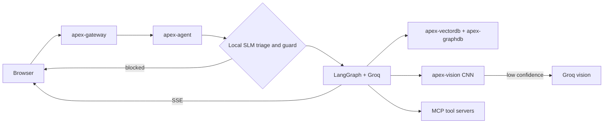

# APEX-AI request flow

```mermaid
flowchart LR
  U[Browser] --> G[apex-gateway]
  G --> A[apex-agent]
  A --> S{Local SLM triage and guard}
  S -- blocked --> U
  S --> L[LangGraph + Groq]
  L --> R[apex-vectordb + apex-graphdb]
  L --> C[apex-vision CNN]
  C -- low confidence --> V[Groq vision]
  L --> M[MCP tool servers]
  L -- SSE --> U
```
